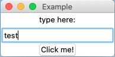

## Description

Tkinter est une bibliothèque qui sert à réaliser des GUI (Graphical User Interface).

Elle est intégrée de base à Python3 (pas besoin d'installation, de faire `pip install`).

## Liens utiles

- [Tutoriel](https://realpython.com/python-gui-tkinter/) Les bases qui permettent de construire une première application simple (un éditeur de texte pour créer des fichiers txt en l'occurrence). Détaille de manière claire la partie graphique.

- [Tutoriel](https://tkdocs.com/index.html) va plus loin dans les explications, en donnant du contexte. Tutoriel multi-langage de programmation.

- [Lien vers pyinstaller](https://www.pyinstaller.org/) afin de générer un fichier exécutable (.exe sur windows)

- [Documentation officielle tkinter](https://docs.python.org/fr/3.9/library/tkinter.html) orientée expert.

## Importer la bibliothèque tkinter et créer un objet tkinter

`from tkinter import *`

`window=Tk()`

`window.mainloop()`

L'objet nommé ici `window` crée l'application. Entre ces 2 lignes, on place les 'widgets' ('bitoniot / petit dispositif de commande' traduction au choix) comme des champs et des boutons.

Les noms des widgets sont explicites Button, Text, Label, Listbox.

Il est possible de les configurer.

L'application peut être liée à une base de données ou une API. Il est possible de générer et de gérer des fichiers.

`ttk` est la version utilisée depuis Python 3.1 avec des widgets associés à des thèmes *graphiques*.

# Avis personnel

Tkinter a été créée initialement en 1988 en tcl, plus ancienne que python donc. Elle existe aussi en PERL et en Ruby.

**Le résultat a vite un look "informatique des années 90".**

Tkinkter utilise, par défaut, les composants du système d'exploitation (windows, mac os ou linux). Le mieux est de conserver le style par défaut.

**Pratique pour faire rapidement des utilitaires de bureau.**

La GUI leader est [electronjs](https://www.electronjs.org/) en javascript basée sur Nodejs (visual studio code, figma, whatApps, slack, facebook messenger et d'autres ont été créées avec)

En Python, la plus sophistiquée est [PyQt](https://fr.wikipedia.org/wiki/PyQt) (dropbox a été développée avec)

[eel](https://pypi.org/project/Eel/) est une version "style electron" allégée utilisant HTML/CSS/JS et basée sur Python [un exemple dans cet article](https://medium.com/wronmbertech/create-a-gui-application-to-translate-text-using-python-9a4e4ef0e52c). les créateurs de 'eel' citent [cefpython](https://pypi.org/project/cefpython3/) comme une version plus proche de electron et aussi plus complexe.
